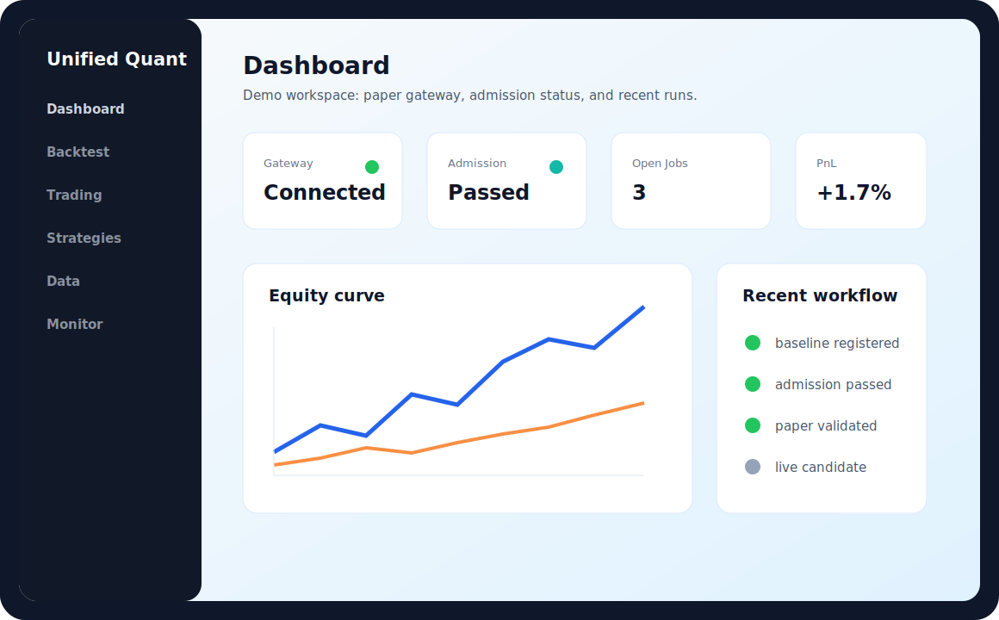
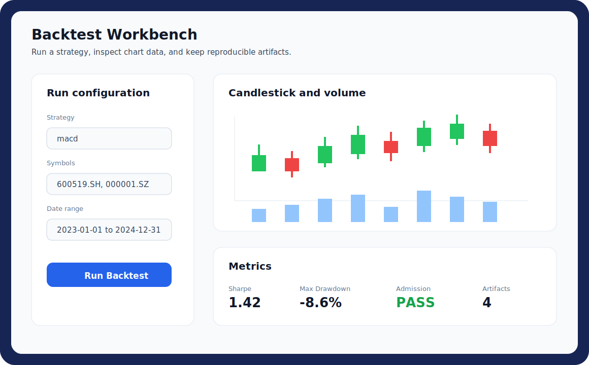

# Unified Quant Platform | A-share Quant Research Platform

[](https://www.python.org/)
[](LICENSE)
[](https://github.com/magic-alt/stock/actions)
[](https://codecov.io/gh/magic-alt/stock)

面向 A 股的开源量化研究与回测平台：策略准入、回测报告、仿真交易、Web 控制台和实盘网关适配器一体化。

A-share quant research platform with strategy admission gates, backtesting, paper trading, a web console, and live gateway adapters.

**Current version**: V5.0.0 | **Updated**: 2026-05-19 | **Status**: local and container workflows ready

## 5-Second Preview


| Dashboard | Backtest workbench |
|---|---|
|  |  |


## Why This Project

- **A-share first**: trading calendar alignment, T+1 constraints, limit-up/down handling, lot sizing, suspension handling, and adjusted-price data workflows.
- **Beyond one backtest**: baseline registration and strategy admission gates help move a strategy from research to paper validation and live preflight.
- **Local product surface**: FastAPI v2 plus a Vue3/Vite/Element Plus console for backtests, strategy library, trading, data, and monitoring.
- **Practical gateway path**: XtQuant/QMT, XTP, Hundsun UFT, EastMoney, paper, stub, and mock routes are separated so development can proceed without unsafe live credentials.

## 30-second Start

```bash
git clone https://github.com/magic-alt/stock.git
cd stock
pip install -r requirements.txt
python examples/one_click_demo.py --out-dir report/open_source_demo
```

The deterministic demo uses the built-in paper gateway and bundled sample data. It writes JSON, Markdown, and ECharts-ready artifacts without broker SDKs, data-provider tokens, or network data fetches.

With Docker Compose:

```bash
docker compose up
```

Open `http://localhost:3000` for the web console and `http://localhost:8000/api/v2/docs` for the OpenAPI UI.

## 5-minute Backtest

```bash
python unified_backtest_framework.py run \
  --strategy macd \
  --symbols 600519.SH \
  --start 2023-01-01 --end 2024-12-31 \
  --plot
```

Useful CLI commands:

```bash
# Strategy list
python unified_backtest_framework.py list

# Grid search
python unified_backtest_framework.py grid --strategy macd --symbols 600519.SH \
  --start 2023-01-01 --end 2024-12-31 \
  --grid '{"fast": [10,12,15], "slow": [26,30]}'

# Portfolio combination from NAV files
python unified_backtest_framework.py combo --navs report/ema_nav.csv report/macd_nav.csv \
  --objective sharpe --step 0.2 --out combo_nav.csv
```

Backtest artifacts are written to `report/` by default, including metrics, snapshots, data-quality reports, Markdown summaries, and optional chart assets.

## Strategy Admission Gates

The differentiator of this project is the strategy admission workflow: a strategy is not considered ready just because one backtest looks good. It must pass fixed historical regimes, data-quality checks, baseline drift checks, and stage gates.

```bash
# Register a historical baseline for fixed parameters
python unified_backtest_framework.py baseline --strategy macd \
  --params '{"fast": 12, "slow": 26, "signal": 9}' \
  --register-strategy-baseline --baseline-alias prod \
  --regimes bull bear range high-vol

# Evaluate admission against the registered baseline
python unified_backtest_framework.py admission --strategy macd \
  --params '{"fast": 12, "slow": 26, "signal": 9}' \
  --profile institutional --baseline-alias prod \
  --regimes bull bear range high-vol
```

Current stage sequence:

```text
research -> baseline_registered -> admission_passed -> paper_validated -> live_candidate -> production
```

See [docs/STRATEGY_ADMISSION_WORKFLOW.md](docs/STRATEGY_ADMISSION_WORKFLOW.md) for the full gate registry, artifact layout, paper-entry gate, portfolio gate, and live preflight behavior.

## Web Console

The web console is a Vue3 + Vite + Element Plus application backed by FastAPI v2.

```bash
# API server
python scripts/run_platform_api.py

# Frontend dev server
cd frontend
npm ci
npm run dev
```

Main views:

| View | Purpose |
|---|---|
| Dashboard | platform status and recent results |
| Backtest | strategy run form, jobs, charts, and metrics |
| Trading | paper/live gateway connection, orders, fills, price injection |
| Strategies | strategy library and quick backtest actions |
| Data | OHLCV browser |
| Monitor | system, queue, gateway, and alert snapshots |
| Settings | local platform settings |

## Architecture

The platform is organized as concentric rings around a kernel. Each ring
depends only on the rings below it and on a single SSOT contract layer, so
strategies, gateways, indicators, data providers, risk rules and ML adapters
can be developed and distributed as independent plugins.

```mermaid
flowchart TB
    subgraph Apps["Apps"]
        CLI["CLI"]
        Web["Web Console"]
        GUI["Desktop GUI"]
        Notebook["Notebook"]
    end
    subgraph Platform["Platform"]
        API["FastAPI v2"]
        Jobs["JobQueue / Orchestrator"]
        Lake["DataLake"]
        Obs["Observability"]
    end
    subgraph Runtime["Runtime contexts"]
        BT["BacktestRuntime"]
        SB["SandboxRuntime (paper)"]
        LV["LiveRuntime"]
    end
    subgraph Engines["Engines"]
        DE["Data"]
        XE["Execution"]
        RE["Risk"]
        PE["Portfolio"]
        BE["Backtest"]
        ML["Research (ML/RL)"]
        RP["Report"]
    end
    subgraph Kernel["Kernel"]
        MB["MessageBus"]
        CA["Cache"]
        CL["Clock"]
        PR["PluginRegistry"]
        FSM["LifecycleFSM"]
        AU["Audit / Vault / Metrics"]
    end
    subgraph Adapters["Adapters (plugin packages)"]
        DP["DataProviders"]
        RT["Realtime feeds"]
        BR["Broker gateways"]
        ST["Storage backends"]
        MLA["ML adapters"]
        MBK["MessageBus backends"]
    end
    subgraph SDK["SDK / Contracts (SSOT)"]
        DTO["DTOs"]
        Ports["Ports"]
        Base["Base classes"]
        Man["PluginManifest"]
    end
    Apps --> Platform
    Platform --> Runtime
    Runtime --> Engines
    Engines --> Kernel
    Kernel --> Adapters
    Adapters --> SDK
    Engines --> SDK
    Runtime --> SDK
```



The diagram above is the **V6 open-platform target**. The V5 production code
still ships from the modules it lives in today; V6 is an additive,
back-compat refactor that exposes existing kernel, plugin, audit and HA
primitives behind stable ports so third parties can ship strategies,
gateways, data sources, indicators, risk rules, fill models, reports,
storage backends and ML adapters as separate Python packages.

Deep architecture references:

- [docs/architecture/open-platform.md](docs/architecture/open-platform.md) — V6 open-platform proposal
- [docs/PLATFORM_GUIDE.md](docs/PLATFORM_GUIDE.md)
- [docs/ARCHITECTURE_REVIEW.md](docs/ARCHITECTURE_REVIEW.md)
- [docs/API_REFERENCE.md](docs/API_REFERENCE.md)

## Capability Matrix

| Area | Current status | Entry point |
|---|---|---|
| Backtesting | Backtrader default, Zipline optional | `unified_backtest_framework.py run --engine backtrader` |
| Strategy library | trend, mean reversion, breakout, portfolio, ML strategy families | `python unified_backtest_framework.py list` |
| Strategy admission | baseline/admission reports plus rollout gate registry | `baseline` / `admission` commands |
| A-share rules | calendar alignment, T+1, limit handling, lot sizing | backtest engine and execution modeling |
| Web console | Dashboard, Backtest, Trading, Strategies, Data, Monitor, Settings | `frontend/` |
| API | versioned FastAPI v2 endpoints | `/api/v2/docs` |
| Paper trading | deterministic paper gateway and demo workflow | `examples/one_click_demo.py` |
| Sample data | bundled synthetic A-share-style OHLCV fixture | `sample_data/a_share_demo_ohlcv.csv` |
| Live gateways | XtQuant/QMT, XTP, Hundsun UFT, EastMoney adapters | [docs/GATEWAY_SDK_SETUP.md](docs/GATEWAY_SDK_SETUP.md) |
| Operations | Docker, Compose, Kubernetes manifests, health checks | [docs/DEPLOYMENT_GUIDE.md](docs/DEPLOYMENT_GUIDE.md) |

## Known Limits

- Real broker SDKs require user-provided accounts, credentials, broker permissions, and local SDK binaries. Stub and mock paths are for development, CI, and integration planning.
- AKShare/TuShare workflows may need network access; TuShare requires `TUSHARE_TOKEN` for token-gated data.
- Demo outputs and sample workflows are for engineering validation and education, not investment advice.
- The open-source focus remains A-share research, backtesting, admission, paper trading, and gateway adapters; some long-term platform work is still evolving.

## Validation

Core validation commands:

```bash
python examples/one_click_demo.py --out-dir report/open_source_demo
python -m pytest tests/ -v --tb=short
python -m mkdocs build --strict
npm --prefix frontend ci
npm --prefix frontend run build
docker compose config
```

Local CI mirror:

```powershell
powershell -ExecutionPolicy Bypass -File scripts/local_ci.ps1 -Jobs test -SkipInstall
```

## Documentation

| Topic | Document |
|---|---|
| Getting started | [docs/getting-started/quick-start.md](docs/getting-started/quick-start.md) |
| Strategy admission | [docs/STRATEGY_ADMISSION_WORKFLOW.md](docs/STRATEGY_ADMISSION_WORKFLOW.md) |
| Strategy reference | [docs/STRATEGY_REFERENCE.md](docs/STRATEGY_REFERENCE.md) |
| REST and Python API | [docs/API_REFERENCE.md](docs/API_REFERENCE.md) |
| Gateway setup | [docs/GATEWAY_SDK_SETUP.md](docs/GATEWAY_SDK_SETUP.md) |
| Broker onboarding | [docs/BROKER_ACCOUNT_GUIDE.md](docs/BROKER_ACCOUNT_GUIDE.md) |
| Deployment | [docs/DEPLOYMENT_GUIDE.md](docs/DEPLOYMENT_GUIDE.md) |
| Operations | [docs/OPERATIONS_RUNBOOK.md](docs/OPERATIONS_RUNBOOK.md) |
| Roadmap | [docs/ROADMAP.md](docs/ROADMAP.md) |

## Contributing

Contributions should use a feature branch and pull request. See [CONTRIBUTING.md](CONTRIBUTING.md) for workflow, validation, and security expectations.

## License

MIT License. See [LICENSE](LICENSE).
