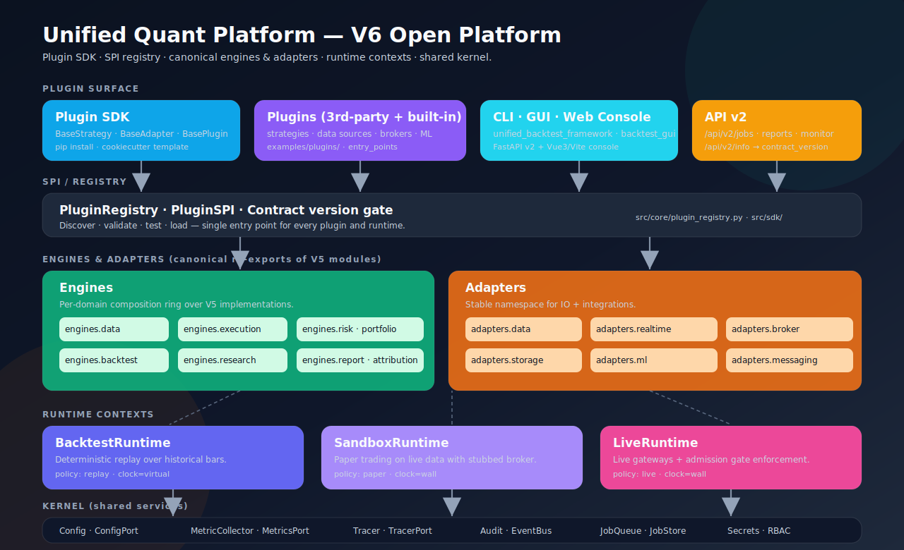
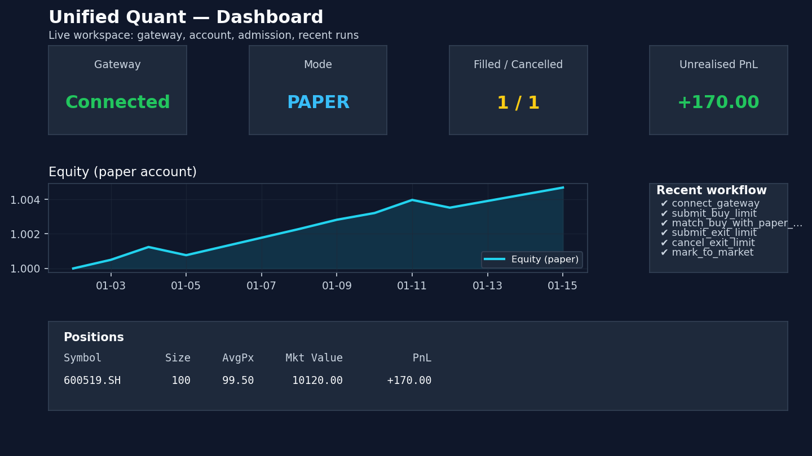
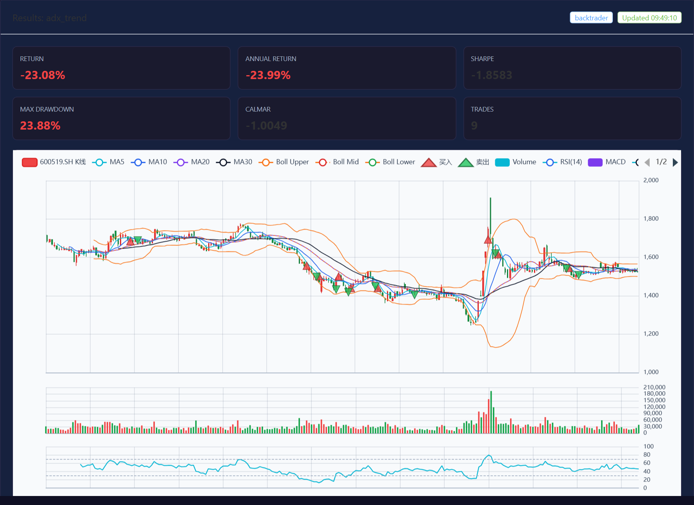
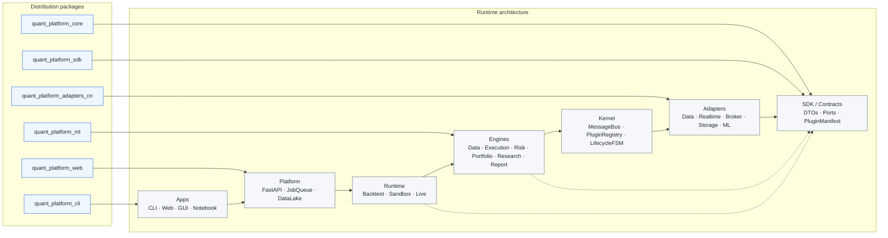

# Unified Quant Platform | A-share Quant Research Platform

[](https://www.python.org/)
[](LICENSE)
[](https://github.com/magic-alt/stock/actions/workflows/ci.yml)
[](https://codecov.io/gh/magic-alt/stock)

面向 A 股的开源量化研究与回测平台：策略准入、回测报告、仿真交易、Web 控制台和实盘网关适配器一体化。

A-share quant research platform with strategy admission gates, backtesting, paper trading, a web console, and live gateway adapters.

**Current version**: V5.0.0 | **Updated**: 2026-05-21 | **Status**: local and container workflows ready

## Platform at a Glance

The two web-console previews below are **real screenshots of the running Vue frontend** (`docker compose up -d api frontend`), captured by [scripts/capture_frontend_previews.py](scripts/capture_frontend_previews.py) (Playwright + Chromium) after running an actual backtest on `600519.SH` through the API. The bottom chart is the **real CLI plot** produced by `python unified_backtest_framework.py run --strategy macd --symbols 600519.SH --plot`, taken straight from the run's `report/<run-id>/backtest_result.png`.



| Dashboard view (live frontend) | Backtest workbench view (live frontend, real backtest) |
|---|---|
|  |  |


## Why This Project

- **A-share first**: trading calendar alignment, T+1 constraints, limit-up/down handling, lot sizing, suspension handling, and adjusted-price data workflows.
- **Beyond one backtest**: baseline registration and strategy admission gates help move a strategy from research to paper validation and live preflight.
- **Local product surface**: FastAPI v2 plus a Vue3/Vite/Element Plus console for backtests, strategy library, trading, data, and monitoring.
- **Practical gateway path**: XtQuant/QMT, XTP, Hundsun UFT, EastMoney, paper, stub, and mock routes are separated so development can proceed without unsafe live credentials.

## 30-second Start

```bash
git clone https://github.com/magic-alt/stock.git
cd stock
pip install -r requirements.txt
python examples/one_click_demo.py --out-dir report/open_source_demo
```

The demo uses the built-in paper gateway and writes JSON, Markdown, and ECharts-ready artifacts without broker SDKs. Stock analysis in the web console fetches real market data through the `auto` provider path, using parallel AKShare, Sina Finance, and Tencent Finance validation before Eastmoney fallback.

With Docker Compose:

```bash
docker compose up
```

Open `http://localhost:3000` for the web console and `http://localhost:8000/api/v2/docs` for the OpenAPI UI.

## 5-minute Backtest

```bash
python unified_backtest_framework.py run \
  --strategy macd \
  --symbols 600519.SH \
  --start 2023-01-01 --end 2024-12-31 \
  --plot
```

Useful CLI commands:

```bash
# Strategy list
python unified_backtest_framework.py list

# Grid search
python unified_backtest_framework.py grid --strategy macd --symbols 600519.SH \
  --start 2023-01-01 --end 2024-12-31 \
  --grid '{"fast": [10,12,15], "slow": [26,30]}'

# Portfolio combination from NAV files
python unified_backtest_framework.py combo --navs report/ema_nav.csv report/macd_nav.csv \
  --objective sharpe --step 0.2 --out combo_nav.csv
```

Backtest artifacts are written to `report/` by default, including metrics, snapshots, data-quality reports, Markdown summaries, and optional chart assets.

## Strategy Admission Gates

The differentiator of this project is the strategy admission workflow: a strategy is not considered ready just because one backtest looks good. It must pass fixed historical regimes, data-quality checks, baseline drift checks, and stage gates.

```bash
# Register a historical baseline for fixed parameters
python unified_backtest_framework.py baseline --strategy macd \
  --params '{"fast": 12, "slow": 26, "signal": 9}' \
  --register-strategy-baseline --baseline-alias prod \
  --regimes bull bear range high-vol

# Evaluate admission against the registered baseline
python unified_backtest_framework.py admission --strategy macd \
  --params '{"fast": 12, "slow": 26, "signal": 9}' \
  --profile institutional --baseline-alias prod \
  --regimes bull bear range high-vol
```

Current stage sequence:

```text
research -> baseline_registered -> admission_passed -> paper_validated -> live_candidate -> production
```

See [docs/STRATEGY_ADMISSION_WORKFLOW.md](docs/STRATEGY_ADMISSION_WORKFLOW.md) for the full gate registry, artifact layout, paper-entry gate, portfolio gate, and live preflight behavior.

## Web Console

The web console is a Vue3 + Vite + Element Plus application backed by FastAPI v2.

```bash
python webui.py
```

This builds or reuses `frontend/dist`, starts the FastAPI WebUI on
`127.0.0.1:8001`, serves the frontend from that same backend, and opens the
browser. Use `python webui.py --no-open` if you only want to start the server.
For frontend hot reload, run `python webui.py --dev`.

Open the Dashboard first. It includes a beginner analysis panel that defaults to real market data (`auto`, using parallel AKShare, Sina Finance, and Tencent Finance validation before Eastmoney fallback) and also supports explicit providers such as `akshare`, `sina`, `tencent`, `eastmoney`, `yfinance`, and `tushare`. The search box accepts normalized symbols, short A-share codes, or common stock names such as `贵州茅台`; analysis records are kept in browser storage and restored when the WebUI is reopened from the same browser origin. Optional AI summaries are only attempted when enabled in the UI and an OpenAI-compatible key is configured through `config.yaml` (`ai.api_key`, `ai.base_url`, `ai.model`) or environment variables (`OPENAI_API_KEY`, `OPENAI_BASE_URL`, `OPENAI_MODEL`).

Main views:

| View | Purpose |
|---|---|
| Dashboard | beginner analysis panel, platform status, quick actions, and recent results |
| Backtest | strategy run form, jobs, charts, and metrics |
| Trading | paper/live gateway connection, orders, fills, price injection |
| Strategies | strategy library and quick backtest actions |
| Data | OHLCV browser |
| Monitor | system, queue, gateway, and alert snapshots |
| Settings | local platform settings |

## Architecture

The platform now has two aligned views: runtime rings for how the system boots,
and distribution packages for how the same code is installed. Runtime imports
stay backward compatible under `src.*`; Phase 7 adds thin `quant_platform_*`
facades and package manifests so plugin authors and operators can install only
the parts they need.



The diagram above is the **V6 open-platform target** with the Phase 7 packaging
boundary added. V5 production code still ships from the modules it lives in
today; V6 remains an additive, back-compat refactor that exposes existing
kernel, plugin, audit and HA primitives behind stable ports.

Distribution packages:

| Package | Import facade | Contents |
|---|---|---|
| `quant-platform-core` | `quant_platform_core` | kernel, contracts, engines, backtest, simulation, pipeline |
| `quant-platform-sdk` | `quant_platform_sdk` | plugin SDK, DTOs, ports, manifests, registry |
| `quant-platform-adapters-cn` | `quant_platform_adapters_cn` | A-share data, realtime, broker, storage and messaging adapters |
| `quant-platform-ml` | `quant_platform_ml` | MLOps, Qlib, FinRL and model adapter modules |
| `quant-platform-web` | `quant_platform_web` | FastAPI platform services and web console metadata |
| `quant-platform-cli` | `quant_platform_cli` | CLI commands, plugin testing and backtest entry points |

Deep architecture references:

- [packages/README.md](packages/README.md) — Phase 7 distribution split
- [docs/architecture/open-platform.md](docs/architecture/open-platform.md) — V6 open-platform proposal
- [docs/PLATFORM_GUIDE.md](docs/PLATFORM_GUIDE.md)
- [docs/ARCHITECTURE_REVIEW.md](docs/ARCHITECTURE_REVIEW.md)
- [docs/API_REFERENCE.md](docs/API_REFERENCE.md)

## Capability Matrix

| Area | Current status | Entry point |
|---|---|---|
| Backtesting | Backtrader default, Zipline optional | `unified_backtest_framework.py run --engine backtrader` |
| Strategy library | trend, mean reversion, breakout, portfolio, ML strategy families | `python unified_backtest_framework.py list` |
| Strategy admission | baseline/admission reports plus rollout gate registry | `baseline` / `admission` commands |
| A-share rules | calendar alignment, T+1, limit handling, lot sizing | backtest engine and execution modeling |
| Web console | Dashboard, Backtest, Trading, Strategies, Data, Monitor, Settings | `frontend/` |
| API | versioned FastAPI v2 endpoints | `/api/v2/docs` |
| Paper trading | deterministic paper gateway workflow | `examples/one_click_demo.py` |
| Market data | real OHLCV providers, validating AKShare, Sina Finance, and Tencent Finance in parallel via `auto`; Eastmoney is a later fallback | `src/data_sources/providers.py` |
| Live gateways | XtQuant/QMT, XTP, Hundsun UFT, EastMoney adapters | [docs/GATEWAY_SDK_SETUP.md](docs/GATEWAY_SDK_SETUP.md) |
| Operations | Docker, Compose, Kubernetes manifests, health checks | [docs/DEPLOYMENT_GUIDE.md](docs/DEPLOYMENT_GUIDE.md) |

## Known Limits

- Real broker SDKs require user-provided accounts, credentials, broker permissions, and local SDK binaries. Stub and mock paths are for development, CI, and integration planning.
- AKShare/TuShare workflows may need network access; TuShare requires `TUSHARE_TOKEN` for token-gated data.
- Demo outputs and paper workflows are for engineering validation and education, not investment advice.
- The open-source focus remains A-share research, backtesting, admission, paper trading, and gateway adapters; some long-term platform work is still evolving.

## Validation

Core validation commands:

```bash
python examples/one_click_demo.py --out-dir report/open_source_demo
python -m pytest tests/ -v --tb=short
python -m mkdocs build --strict
npm --prefix frontend ci
npm --prefix frontend run build
docker compose config
```

Local CI mirror:

```bash
python scripts/local_ci.py --jobs test --skip-install
```

Windows PowerShell remains supported:

```powershell
powershell -ExecutionPolicy Bypass -File scripts/local_ci.ps1 -Jobs test -SkipInstall
```

## Documentation

| Topic | Document |
|---|---|
| Getting started | [docs/getting-started/quick-start.md](docs/getting-started/quick-start.md) |
| Strategy admission | [docs/STRATEGY_ADMISSION_WORKFLOW.md](docs/STRATEGY_ADMISSION_WORKFLOW.md) |
| Strategy reference | [docs/STRATEGY_REFERENCE.md](docs/STRATEGY_REFERENCE.md) |
| REST and Python API | [docs/API_REFERENCE.md](docs/API_REFERENCE.md) |
| Gateway setup | [docs/GATEWAY_SDK_SETUP.md](docs/GATEWAY_SDK_SETUP.md) |
| Broker onboarding | [docs/BROKER_ACCOUNT_GUIDE.md](docs/BROKER_ACCOUNT_GUIDE.md) |
| Deployment | [docs/DEPLOYMENT_GUIDE.md](docs/DEPLOYMENT_GUIDE.md) |
| Operations | [docs/OPERATIONS_RUNBOOK.md](docs/OPERATIONS_RUNBOOK.md) |
| Roadmap | [docs/ROADMAP.md](docs/ROADMAP.md) |

## Contributing

Contributions should use a feature branch and pull request. See [CONTRIBUTING.md](CONTRIBUTING.md) for workflow, validation, and security expectations.

## License

MIT License. See [LICENSE](LICENSE).
