# V6 Open Platform Architecture

> Status: **proposal (Phase 0)** — this document defines the target architecture for V6.
> No runtime code has moved yet. V5 capabilities (strategy admission, A-share rules,
> RBAC, audit hash chain, DR drill, MLOps) remain intact and continue to ship from
> their current modules. V6 is an **additive, back-compat refactor** that re-exposes
> existing assets and opens stable extension points to third-party plugin authors.

## Why V6

The V5 README architecture diagram compresses the platform into five boxes
(`CLI/GUI → API → Engines → Reports / Risk / Gateways`). That picture hides
capabilities that the repository already implements and that any serious quant
platform must expose to plugin authors:

- a real event-driven kernel (`src/core/message_bus.py`, `src/core/events.py`),
- a plugin manager (`src/core/plugin.py`, `src/core/strategy_loader.py`),
- a repository / cache layer (`src/core/repository.py`),
- security and audit primitives (`src/core/audit.py`, `src/core/vault.py`,
  `src/core/security.py`),
- HA / reconciliation (`src/core/ha.py`, `src/core/reconciliation.py`),
- three environment contexts — backtest, paper, live — that already coexist
  but boot through different entry points.

V6 reorganizes the project around a **kernel-centric, ports-and-adapters,
plugin-first** model inspired by Nautilus Trader, QuantConnect Lean, vnpy and
Qlib. Goals:

1. Make every extension point a stable, versioned contract.
2. Let third parties ship strategies, gateways, data sources, indicators, risk
   rules, fill models, reports, storage backends and ML adapters as **separate
   Python packages** discovered through entry points.
3. Keep the same code path between research and live, modeled on Nautilus
   research-to-live parity.
4. Preserve every V5 capability behind a thin re-export shim; no breaking
   imports during the V6 transition.

## Reference platforms

| Platform | Pattern we adopt |
|---|---|
| Nautilus Trader | Kernel + MessageBus + Cache + DataEngine/ExecutionEngine/RiskEngine, environment contexts (Backtest / Sandbox / Live), Component finite state machine, ports & adapters, research-to-live parity |
| QuantConnect Lean | Every component is a documented plug-in point; unified CLI for backtest / research / optimize / live |
| vnpy 4.x | Gateway / App / Datafeed / Database shipped as independent PyPI packages; core framework keeps only EventEngine + MainEngine |
| Microsoft Qlib | Loose-coupled Infrastructure / Learning Framework / Workflow / Interface layers; each layer usable stand-alone |
| vectorbt | Vectorized batch backtesting with an optional native backend, leaving room for a future native engine |

## Target architecture

```mermaid
flowchart TB
    subgraph Apps["Apps"]
        CLI["CLI"]
        Web["Web Console (Vue3)"]
        GUI["Desktop GUI"]
        Notebook["Jupyter / Notebook"]
    end

    subgraph Platform["Platform"]
        API["FastAPI v2"]
        JobQueue["JobQueue"]
        Orchestrator["Orchestrator / Scheduler"]
        DataLake["DataLake"]
        Observability["Observability"]
    end

    subgraph Runtime["Runtime contexts"]
        BacktestRT["BacktestRuntime"]
        SandboxRT["SandboxRuntime (paper)"]
        LiveRT["LiveRuntime"]
    end

    subgraph Engines["Engines"]
        DataEng["DataEngine"]
        ExecEng["ExecutionEngine"]
        RiskEng["RiskEngine"]
        PortEng["PortfolioEngine"]
        BTEng["BacktestEngine"]
        ResEng["ResearchEngine (ML/RL)"]
        RepEng["ReportEngine"]
    end

    subgraph Kernel["Kernel"]
        MsgBus["MessageBus"]
        Cache["Cache"]
        Clock["Clock"]
        Registry["PluginRegistry"]
        FSM["LifecycleFSM"]
        Audit["Audit"]
        Vault["Vault"]
        Metrics["Metrics / Tracer"]
    end

    subgraph Adapters["Adapters"]
        DataProv["DataProviders"]
        Realtime["Realtime feeds"]
        Brokers["Broker gateways"]
        Storage["Storage backends"]
        MLAd["ML adapters"]
        MsgBackend["MessageBus backends"]
    end

    subgraph SDK["SDK / Contracts (SSOT)"]
        DTO["DTOs: Instrument, Bar, Order, Fill..."]
        Ports["Ports: DataProviderPort, BrokerGatewayPort..."]
        Base["Base classes: BaseStrategy, BaseIndicator..."]
        Manifest["PluginManifest + CONTRACT_VERSION"]
    end

    Apps --> Platform
    Platform --> Runtime
    Runtime --> Engines
    Engines --> Kernel
    Kernel --> Adapters
    Adapters --> SDK
    Engines --> SDK
    Runtime --> SDK
```



The diagram is concentric: every layer depends only on the layers below it and
on `SDK / Contracts`. `SDK / Contracts` has no dependencies on any other ring.

## Rings explained

### Kernel — `src/core/kernel.py` (new in Phase 1)

The kernel owns process-wide singletons and lifecycle:

- **MessageBus** — the only inter-engine channel for events and commands. The
  current `src/core/message_bus.py` becomes the default in-process backend.
- **Cache** — instruments, accounts, orders, positions, bars; backed by
  `src/core/repository.py`.
- **Clock** — wall-clock in live / sandbox, simulated clock in backtest.
- **PluginRegistry** — discovers `entry_points`, validates manifests against
  the SDK `CONTRACT_VERSION`, sandboxes hot-loaded strategies via
  `src/core/strategy_loader.py` AST `CodeSafety`, and emits lifecycle events
  on the bus.
- **LifecycleFSM** — every engine and adapter transitions through
  `PRE_INITIALIZED → READY → RUNNING → STOPPING → STOPPED → DISPOSED`, plus
  `DEGRADED` and `FAULTED`, modeled on Nautilus `ComponentState`. Reuses
  `src/core/monitoring.py` for state tracking.
- **Audit / Vault / Metrics** — `src/core/audit.py`, `src/core/vault.py`,
  `src/core/monitoring.py` are registered at kernel boot so engines and
  adapters can resolve them through ports.

### Domain & SDK — `src/core/contracts/` (new in Phase 2)

Pure value objects and abstract ports. No I/O. Versioned by a single
`CONTRACT_VERSION` constant exposed as `quant_platform.__contract_version__`
and on `/api/v2/info`.

| Group | Types |
|---|---|
| DTOs | `Instrument`, `Bar`, `Tick`, `OrderBookSnapshot`, `Order`, `Fill`, `Position`, `AccountSnapshot`, `Signal`, `RiskCheckResult`, `BacktestResult` |
| Ports | `DataProviderPort`, `RealtimeFeedPort`, `BrokerGatewayPort`, `OrderRouterPort`, `RiskRulePort`, `FillModelPort`, `SlippageModelPort`, `StoragePort`, `ReportPort`, `MetricsPort`, `TracerPort`, `AuditPort`, `MLAdapterPort`, `SchedulerPort`, `MessageBusPort`, `VaultPort`, `AdmissionGatePort` |
| Base classes | `BaseStrategy`, `BaseIndicator`, `BaseFactor`, `BaseRiskRule`, `BaseFillModel`, `BaseGateway`, `BaseDataProvider`, `BaseReportRenderer` |
| Plugin manifest | `PluginManifest` (id, name, version, kind, entry_point, contract_version, capabilities, permissions, requires) |

Every port has a conformance test in `tests/contracts/<port>.py` so that any
internal or third-party implementation can verify compliance with one command.

### Engines — `src/engines/` (new in Phase 3)

Engines wrap existing implementations. They consume only the kernel and the
ports defined in the SDK.

| Engine | Wraps |
|---|---|
| DataEngine | `src/data_sources/`, `src/core/realtime_data.py` |
| ExecutionEngine | `src/core/trading_gateway.py`, `src/core/order_manager.py`, `src/core/paper_gateway_v3.py`, `src/simulation/matching_engine.py` |
| RiskEngine | `src/core/risk_manager_v2.py`, `src/core/pre_trade_risk.py`, `src/core/reconciliation.py` |
| PortfolioEngine | `src/core/portfolio.py`, `src/core/capital_allocator.py`, `src/core/account_manager.py` |
| BacktestEngine | `src/backtest/engine.py`, `src/backtest/engine_base.py`, `src/backtest/zipline_bundle.py` |
| ResearchEngine | `src/mlops/`, `src/optimizer/` |
| ReportEngine | `src/backtest/report_generator.py`, `src/backtest/plotting.py` |

### Adapters — `src/adapters/` (new in Phase 4)

Each adapter implements one port and exposes a `register(kernel)` entry point.
Default in-tree adapters keep the same code; their import paths stay valid via
re-export shims under `src/_legacy/`.

| Port | Default adapters | Source modules |
|---|---|---|
| DataProviderPort | akshare, tushare, yfinance, qlib | `src/data_sources/providers.py`, `src/mlops/qlib_adapter.py` |
| RealtimeFeedPort | sina, eastmoney, tencent, level2 | `src/core/realtime_providers/`, `src/data_sources/level2/` |
| BrokerGatewayPort | xtquant, xtp, hundsun_uft, paper | `src/gateways/`, `src/core/paper_gateway_v3.py` |
| StoragePort | sqlite, duckdb, parquet, redis | `src/data_sources/db_manager.py`, `src/data_sources/duckdb_store.py`, `src/platform/data_lake*.py` |
| MLAdapterPort | qlib, finrl, sklearn | `src/mlops/qlib_adapter.py`, `src/mlops/finrl_adapter.py` |
| MessageBusPort | inproc, zmq, redis | `src/core/message_bus.py` |

### Runtime contexts — Phase 6

Three thin runtimes boot the kernel and wire adapters per config:

- `BacktestRuntime` — historical data + simulated venue (mirrors Nautilus
  `BacktestNode`).
- `SandboxRuntime` — real-time data + simulated venue (paper trading).
- `LiveRuntime` — real-time data + live venue (mirrors Nautilus
  `TradingNode`).

All three share the same engines and ports. The only difference is which
adapters the runtime asks the kernel to register.

### Platform & Apps — Phase 6 / 7

`src/platform/` (FastAPI v2, JobQueue, Orchestrator, DataLake) resolves engines
from the kernel instead of importing internal modules directly. Apps (CLI,
Web, GUI, Notebook) speak only to the platform layer or to the SDK.

## Plugin SPI

V6 publishes one Python `entry_points` group per port. A third-party
distribution declares plugins in its own `pyproject.toml`:

```toml
[project.entry-points."quant_platform.strategy"]
my_macd = "my_pkg.strategies:MacdStrategy"

[project.entry-points."quant_platform.gateway"]
my_broker = "my_pkg.gateways:MyBrokerGateway"
```

The full group catalog:

| Group | Kind |
|---|---|
| `quant_platform.strategy` | Trading strategies |
| `quant_platform.indicator` | Technical indicators |
| `quant_platform.factor` | Research factors |
| `quant_platform.data_provider` | Historical data providers |
| `quant_platform.realtime_feed` | Live market data feeds |
| `quant_platform.gateway` | Broker / venue gateways |
| `quant_platform.storage` | Storage backends |
| `quant_platform.risk_rule` | Pre-trade and runtime risk rules |
| `quant_platform.fill_model` | Backtest fill / slippage / fee models |
| `quant_platform.report` | Report renderers and exporters |
| `quant_platform.scheduler` | Job and pipeline schedulers |
| `quant_platform.ml_adapter` | ML / RL framework adapters |
| `quant_platform.messaging` | MessageBus backends |
| `quant_platform.admission_gate` | Strategy admission gate rules |

Every plugin ships a manifest validated against `CONTRACT_VERSION`. Plugins
that declare elevated permissions (file system writes, network access, vault
reads) must be signed in production deployments; the AST `CodeSafety` check
remains the default sandbox for hot-loaded strategies, with subprocess and
container isolation left to the operator.

### Phase 5 SDK status

Phase 5 adds the first importable SDK facade and author tooling:

- `src/sdk/` re-exports the frozen DTO / Port / `PluginManifest` surface from
  `src/core/contracts/` plus small base classes for common plugin kinds.
- `src/core/plugin_registry.py` provides `PluginRegistry`, manifest loading,
  entry-point group metadata, permission checks, and local conformance tests.
- `templates/cookiecutter-plugin/` contains the third-party plugin scaffold.
- `examples/plugins/simple_momentum_plugin/` is a minimal strategy plugin that
  can be tested without installing a package:

```bash
python -m src.cli.main plugin test simple_momentum_plugin:MANIFEST --path examples/plugins/simple_momentum_plugin
```

Installed distributions can expose the same command through the
`quant-platform` console script.

## Migration discipline

V6 lands in eight additive phases. Each phase is its own branch and PR; every
phase must keep the existing test suite green (current baseline: 1157 passed,
35 skipped) and update `CHANGELOG.md` per `AGENTS.md`.

| Phase | Scope | Touches code? |
|---|---|---|
| 0 | Architecture decisions, contract freeze, this document | No (docs + pyproject only) |
| 1 | Kernel hardening (`src/core/kernel.py`, FSM, MessageBus polish) | Additive |
| 2 | Domain contracts SSOT (`src/core/contracts/`) | Additive + re-exports |
| 3 | Engines split (`src/engines/`) | Additive wrappers |
| 4 | Adapters reshuffle (`src/adapters/`) | Re-exports + new layout |
| 5 | Plugin SPI + SDK (`src/sdk/`) + conformance tests + sample plugin | Additive |
| 6 | Platform / runtime alignment, unified observability | Internal refactor |
| 7 | Distribution split (`quant_platform_core / sdk / adapters_cn / ml / web / cli`) | Packaging |
| 8 | Deprecation of legacy paths via `src/_legacy/` shims | Cleanup |

## Non-goals for V6

- **No language rewrite.** Performance gains stay incremental via Numba,
  Polars and DuckDB. A native engine remains a long-term option, not a V6
  commitment.
- **No microservice split.** The kernel stays in-process; the platform keeps
  the existing modular monolith + Docker Compose deployment model. Splitting
  engines into services is a future milestone.
- **No multi-market expansion in V6.** A-share remains the primary domain.
  Multi-market support stays in the long-term roadmap.

## See also

- [Architecture overview](overview.md)
- [Architecture review](../ARCHITECTURE_REVIEW.md)
- [Target architecture (V5 baseline)](../ARCHITECTURE_TARGET_STATE.md)
- [V5 upgrade plan](v5-upgrade.md)
- [Roadmap](../ROADMAP.md)
